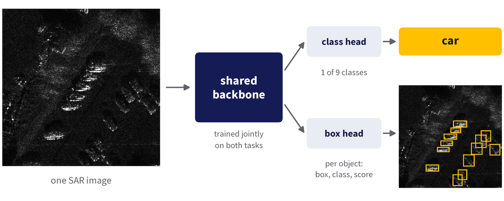
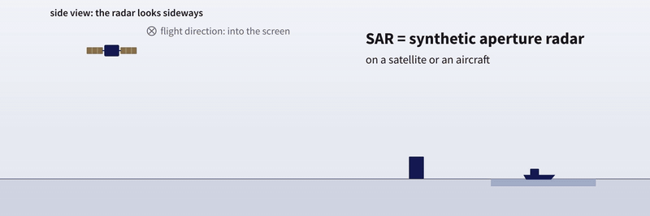
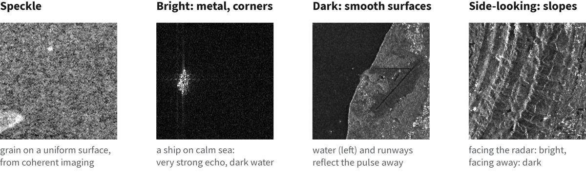
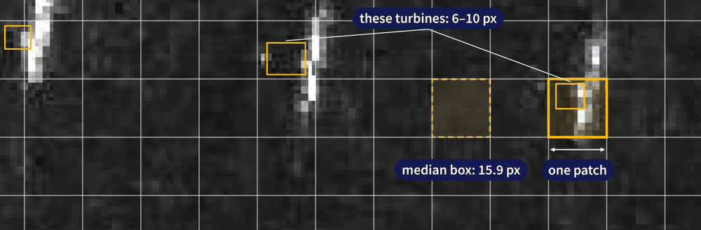

# CS701 SAR multi-task benchmark

Reference code for the CS701 team assignment: one ViT-B/16 backbone, trained jointly to **classify** a SAR
image (9 classes) and **detect** its objects (Faster R-CNN).



## SAR in 30 seconds



- **Active radar.** A satellite or aircraft sends microwave pulses and records the echoes, so it images by day,
  by night and through clouds. It looks sideways, not straight down.
- **Synthetic aperture.** Echoes of one target, collected along the flight path, are combined into one long
  virtual antenna. That gives a fine resolution along the track.
- **Pixel = echo strength.** No colour: our images are 8-bit grey. Metal and corners are bright, calm water
  is dark, and coherent imaging adds a grainy pattern called speckle.

<details>
<summary>What SAR images look like</summary>



</details>

## Task and metric

- Each image has one class label and one or more boxes, all of that class. Predict both.
- Classification is scored by macro-F1, detection by COCO mAP.
- The leaderboard ranks by **Δm**, the mean relative change of macro-F1 and mAP against a reference model:
  `Δm = 100% × ½ [(F1 − F1_ref) / F1_ref + (mAP − mAP_ref) / mAP_ref]`. 0 = as good as the reference, > 0 = better.
- Data, formats and rules: the [dataset card](https://huggingface.co/datasets/doem1997/cs701-sar-course-data).

Objects are small: half of all boxes are smaller than one 16 × 16 ViT patch (at 512 × 512 input).



## Quick start

```bash
conda create -n cs701bench python=3.12 -y && conda activate cs701bench
pip install -r requirements.txt          # CUDA 12.8 builds of torch 2.9.0 / torchvision 0.24.0

python train.py --backbone vit --init pretrained --adapt lora   # one experiment, about 50 min
bash run_all.sh                                                  # all eight, about 7 h
```

Options: `--backbone vit|terramind`, `--init pretrained|scratch`, `--adapt full|lora|moelora`; see
`python train.py -h`. Pretrained weights download from Hugging Face on first use (ViT 0.4 GB, TerraMind 1.5 GB).
Times are for one RTX PRO 6000 Blackwell GPU; memory needs are in [docs/DETAILS.md](docs/DETAILS.md#time-and-memory).

## Using it with the course data

The data is on [Hugging Face](https://huggingface.co/datasets/doem1997/cs701-sar-course-data); rules and
leaderboard are on [Codabench](https://www.codabench.org/competitions/18248). TA Zichen ran this code on the fully
labelled data in a different folder layout, so adapt `data.py` and `train.py`:

- train on `train/labels.csv` and `train/instances.json`;
- hold out part of train for local validation (val and test come without labels);
- predict on the images in `val/images.json` and `test/images.json`.

`make_submission.py` has `write_submission`, the function shown in the briefing video: it maps your boxes
back to original image pixels and writes the `submission.zip` for Codabench.

## Results

| backbone | adaptation | trained backbone params | macro-F1 | mAP | Δm |
|---|---|---:|---:|---:|---:|
| ViT (ImageNet-21k) | full fine-tuning | 86.0 M | 95.8 ± 0.3 | 31.8 ± 0.2 | +0.3 ± 0.4 |
| ViT (ImageNet-21k) | LoRA | 0.88 M | 94.0 ± 0.2 | 25.4 ± 0.5 | −10.6 ± 0.7 |
| ViT (ImageNet-21k) | MoE-LoRA | 1.03 M | 93.4 ± 0.5 | 26.8 ± 0.3 | −8.7 ± 0.7 |
| TerraMind (Earth observation) | full fine-tuning | 85.3 M | 95.6 ± 0.2 | 30.8 ± 0.4 | −1.3 ± 0.6 |
| TerraMind (Earth observation) | LoRA | 0.88 M | 92.6 ± 0.4 | 26.5 ± 0.4 | −9.7 ± 0.9 |
| TerraMind (Earth observation) | MoE-LoRA | 1.03 M | 92.4 ± 0.1 | 27.8 ± 0.3 | −7.7 ± 0.5 |
| ViT, from scratch | full training | 86.0 M | 82.8 ± 0.7 | 17.0 ± 0.3 | −29.8 ± 0.8 |
| TerraMind, from scratch | full training | 85.3 M | 86.1 ± 0.2 | 17.8 ± 0.5 | −26.9 ± 0.7 |

Test split, %, mean ± std over 3 seeds. The Δm reference is the seed-0 run of ViT full fine-tuning (95.43 / 31.67).

<details>
<summary>Val results</summary>

Val split, %, mean ± std over 3 seeds; Δm against the seed-0 reference run on val (94.47 / 31.57).

| backbone | adaptation | trained backbone params | macro-F1 | mAP | Δm |
|---|---|---:|---:|---:|---:|
| ViT (ImageNet-21k) | full fine-tuning | 86.0 M | 94.4 ± 0.3 | 32.0 ± 0.4 | +0.6 ± 0.6 |
| ViT (ImageNet-21k) | LoRA | 0.88 M | 93.3 ± 0.4 | 26.1 ± 0.4 | −9.2 ± 0.8 |
| ViT (ImageNet-21k) | MoE-LoRA | 1.03 M | 92.2 ± 0.8 | 27.1 ± 0.2 | −8.2 ± 0.8 |
| TerraMind (Earth observation) | full fine-tuning | 85.3 M | 94.2 ± 0.3 | 31.5 ± 0.1 | −0.3 ± 0.2 |
| TerraMind (Earth observation) | LoRA | 0.88 M | 92.2 ± 0.4 | 27.0 ± 0.5 | −8.5 ± 1.1 |
| TerraMind (Earth observation) | MoE-LoRA | 1.03 M | 91.9 ± 0.4 | 28.8 ± 0.1 | −5.7 ± 0.3 |
| ViT, from scratch | full training | 86.0 M | 83.5 ± 0.9 | 18.2 ± 0.5 | −26.9 ± 1.1 |
| TerraMind, from scratch | full training | 85.3 M | 86.0 ± 0.9 | 19.2 ± 0.4 | −24.2 ± 1.0 |

Accuracy and AP50 are in [docs/DETAILS.md](docs/DETAILS.md#results-in-full).

</details>

<details>
<summary>Files</summary>

| file | role |
|---|---|
| `data.py` | images and boxes at 512 × 512, flips, normalization; boxes back to original pixels |
| `backbones.py` | the two ViT-B/16 backbones: timm ViT (ImageNet-21k) and TerraMind-1.0-base |
| `adapters.py` | LoRA and MoE-LoRA around the attention layers of a frozen backbone |
| `model.py` | backbone + classification head + ViTDet feature pyramid + Faster R-CNN |
| `metrics.py` | accuracy, macro-F1, balanced accuracy, confusion matrix; COCO box AP |
| `train.py` | one experiment: train, validate, test, save |
| `run_all.sh` | the eight reference runs |
| `make_submission.py` | writes a Codabench submission zip from predictions |
| `tests/` | checks of the data, metrics, backbones, adapters and model |

</details>

More in [docs/DETAILS.md](docs/DETAILS.md): the model, training protocol, design notes, time and memory,
what a run writes, and the checks.

## Links

- Dataset card: https://huggingface.co/datasets/doem1997/cs701-sar-course-data
- Leaderboard: https://www.codabench.org/competitions/18248
- Questions: zichen.tian.2023@phdcs.smu.edu.sg
